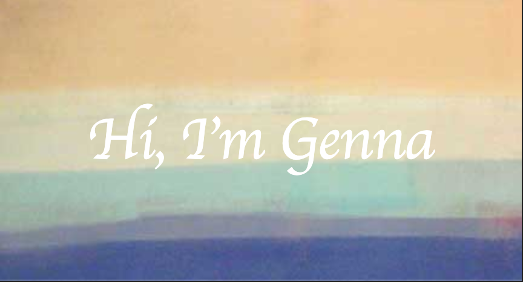

<h3>Check out my <a href="https://gennakearney.com/">Portfolio Website</a></h3>

  

    Click for some info on me
  

</detials>
Through my journey as a professional modern dancer and yoga/fitness instructor I found an interest in learning to code. Finally, I decided it was time I stop thinking about it and start learning. While performing professionally for Artichoke Dance Company, a company member I danced with was a full time Software Engineer while dancing professionally part time. Once I started to teach myself to code I would often ask him questions on what I had just learned. I thought it was so great to be asking coding advice from a fellow dancer, I never would have thought! Also, through my career in yoga and fitness with Corepower Yoga and Jane DO I have had the pleasure of connecting with so many awesome professionals in the tech industry I knew coding was the perfect next step for me. Shortly after I began my coding journey, my husband and I moved to San Francisco from NYC due to a new job opportunity. While in San Francisco, I found Rithm School coding bootcamp and after doing my research I knew I had to interview. I am now a graduate of Rithm school and ready to start my new journey in the tech industry! My journey to becoming a Software Engineer has definitely been a non-traditional one, but I wouldn't change it. It has made me the engineer and person I am today. I am passionate about coding as well as physical and mental health, if you share any of my passions, or just want to chat, please reach out to me through my contact page, I'd love to hear from you!